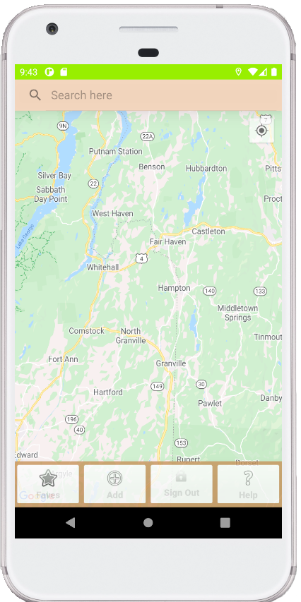

## Xavier Stone - ePortfolio

   When I was a kid I used to make games; I mean all the time. Sure at first I would bend the rules to win, but as time went on I began designing for a higher power: the raw beauty of the game itself. A well-designed game is basically just an elegant mathematical algorithm with a fancy interface, so it's no surprise that when I discovered the BASIC compiler on my middle school's laboratory computer it was a match made in heaven. Through most of high school, programming was still about the game, but at some point along the way it began to be more and more about the sheer elegance of writing some gorgeous code. This deeper beauty is what drew me to a computer science degree. Once you get past all the red tape of inconsistent interoperability and competing conventions, all you're left with is essentially mathematics, and I'm good at math. Through the Southern New Hampshire University Computer Science Degree Program, culminating in the Capstone project, I have distilled not only a well-rounded array of desirable computer skills and habits, but the essence of why Computer Science appeals to me as well.
    In my early personal experiments with programming, I was a maverick, and not really in a good way. My early programs were function-less lists of procedural code: a house of cards that a single typo could render non-functional. I got a little bit better as time went on, but it wasn't really until this degree program that I started to really internalize the value of structure and organization. I'm a good student, but being a good student is basically just being good at following directions, so that's not really a bragging point. This program didn't teach me how to be a good student though, it taught me how to think for myself and follow my own compass. Many times throughout the course of this program I encountered outdated technology, graded assignments with crucial typos in them, and simply incorrect instructions. I am thankful for these defects because they forced me to think outside the box and to solve unexpected problems on the fly. An example of this, which is an example of collaborative skills as well, was the class on team work and version control. The code we were provided for the class looked like something I would've written in high school. Each classmate was represented as an entirely new class named after them, which all had exactly the same attributes! A better solution would be to create a class Student with a “name” attribute and just create instances of it for each student. This was only the first of many enhancements I pitched to the class via the BitBucket communication interface. I was not surprised to receive little interest, but luckily a few other students jumped on board and we were able to really improve the code. Now if they would only incorporate those changes into the next semester... but is that really the point?
	I definitely learned to communicate to a variety of audiences in this program, from children to students to peers to stakeholders. In my class on Hardware Components we were asked to design a shopping list of components for a small photo start up, and I meticulously identified the best fit for each internal desktop component, which was far beyond the requirements for the project. In addition, I took care to explain the reasoning behind each choice in terms the non-technical CEO would understand. This general approach was utilized in most of my other classes too. As previously mentioned though, the core appeal of computer science for me is in the data structures and algorithms. This appeal grew even stronger throughout this program. For example, I have created a breadth of modular functions for my OpenGL class to reduce the repetition inherent in graphics programming.
	Certainly, though, the strongest testament to my skills is the capstone project, Backyard. This is a campsite locator app I built from scratch, initially for a Computer Platform Technologies class. That class, unlike so many of my classes, just threw me overboard essentially from day one and challenged me to figure out how to swim. The result was well-received, but underwhelming by my own standards: far too reminiscent of my old coding practices. However, this also made it the perfect candidate for an ePortfolio: not only do I get to showcase the whole gamut of skills by building an app, I get to massively improve a previous piece of work. Due to the wide range of technologies and abilities required to put this project together, it serves as a singular demonstration of my capabilities. In addition to the above mentioned skills, which are all represented in this project as well – version control leaving room for eventual collaboration, communication with stakeholders, and data structures/algorithms – software engineering/database skills as well as security feature in this project. The locally stored SQLite database used in the original app has been upgraded to a remote MongoDB instance which the app can communicate with via a special server that I built off of a simple Spring tutorial (Spring, 2020). Essentially, though, I configured a fully-functioning stack myself. Security was limited to password hashing for the scope of this project, but will be extended down the line. In conclusion, this program has been very valuable to me and helped to shape me into a well-rounded candidate for a software development position.

### Introducing: Backyard
Your friendly neighborhood guide to your friendly neighborhood!
Find, share, and review campsites, swimming holes, and special local spots!

[Github Repository](https://github.com/xavierstone/backyard)  |  [Backyard Server](https://github.com/xavierstone/backyard_server)  |  [Initial Code Review](https://youtu.be/XGgiA1RYGAk "Code Review on Youtube")

